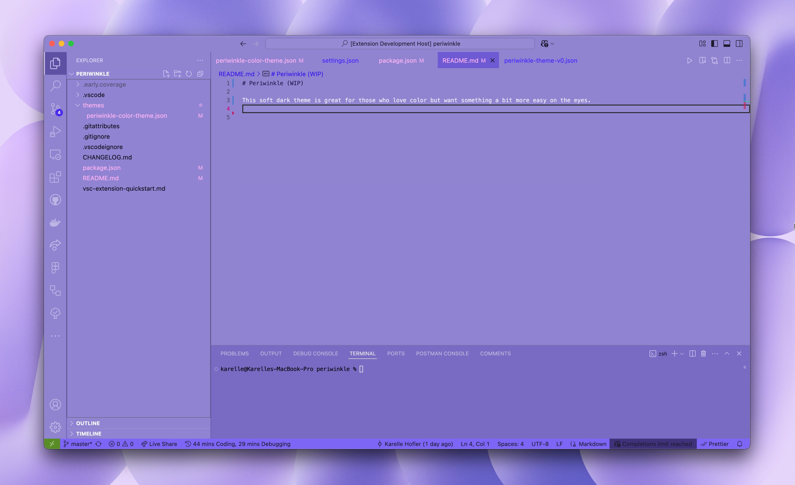

# Periwinkle (beta)

This soft dark theme is great for those who love color but want something a bit more easy on the eyes.

🚧 Periwinkle is still in development so if you come across anything please let me know. Your feedback is very helpful. Thank you!

Why Periwinkle?
I created Periwinkle because I was tired of seeing the same traditional dark themes in the marketplace. I wanted to see more soft dark themes, themes that are not completely dark but not completely light either. At the time I also chose this color because I wanted it to match my favorite Logitech keyboard that's periwinkle 😅

Features:
Variants (Coming Soon!) I’m currently working on additional variants to make Periwinkle even more versatile:

High Contrast: For improved visibility in low-light conditions.

Light Mode: A brighter alternative for those who prefer light themes.

High Contrast Light Mode: A high-contrast version of the light theme for maximum accessibility.

Stay tuned for updates on Twitter/X and Threads: @itskarelleh

Installation
Open the Extensions sidebar in VS Code (Ctrl+Shift+X or Cmd+Shift+X on macOS).

Search for Periwinkle Color Theme.

Click Install.

Open the Command Palette (Ctrl+Shift+P or Cmd+Shift+P on macOS) and select Preferences: Color Theme.

Choose Periwinkle from the list.

Contributing
If you’d like to contribute to Periwinkle, feel free to open an issue or submit a pull request. I’m always open to feedback and suggestions!

License
Periwinkle is licensed under the MIT License. Feel free to use, modify, and distribute it as you see fit.

Support
If you enjoy using Periwinkle, consider giving it a ⭐️ on the Visual Studio Code Marketplace or GitHub. Your support means a lot!